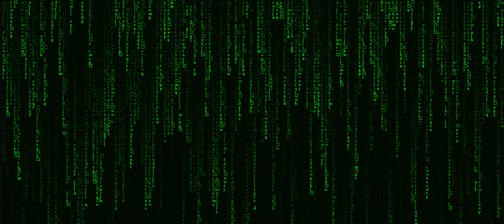

<h1 align="center" style="color: #0f0"> Matrix </h1>

Tela inicial do Filme Matrix.

  <a href="#-tecnologias">Tecnologias</a>&nbsp;&nbsp;&nbsp;|&nbsp;&nbsp;&nbsp;
  <a href="#-projeto">Projeto</a>&nbsp;&nbsp;&nbsp;

  

 

  

## 🚀 Tecnologias

Projeto foi desenvolvido com as seguintes tecnologias:

- HTML e CSS
- JavaScript

## 💻 Projeto

Landing Page do Filme Matrix, um título maravilhoso por sinal.  

## 🔖 Layout

Você pode visualizar o resultado clincando neste [LINK](https://kiqprado.github.io/Matrix/).

---
 

  
  &nbsp;&nbsp;&nbsp;|&nbsp;&nbsp;&nbsp;
  
 

